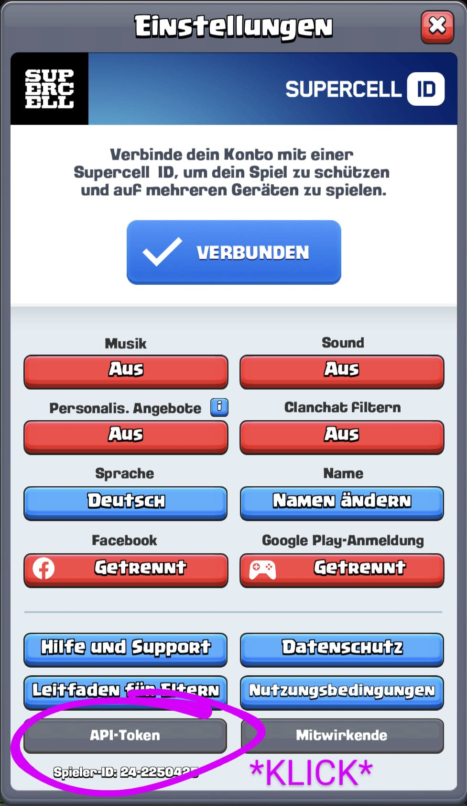
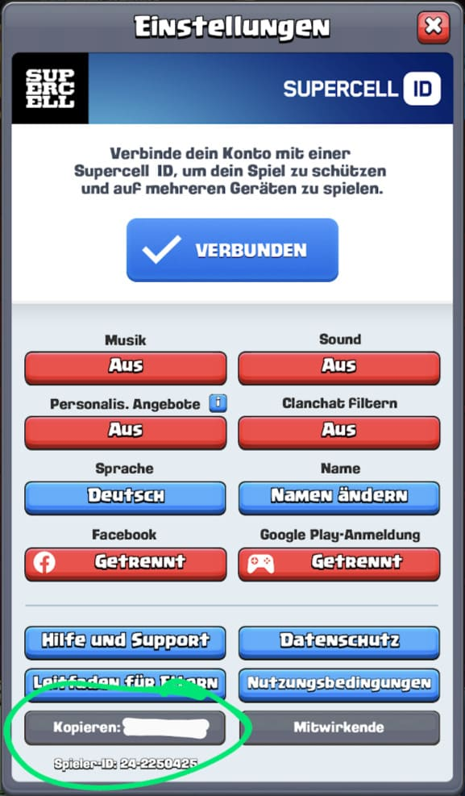

# Deadman-Walking Discord Bot

Discord Bot des Deadman-Walking Clans in Clash Royale.
Dieser Bot erinnert Spieler via Discord, wenn diese vergessen am Flussrennen teilzunehmen.

Spieler können ihren Clash Royale Account mit ihrem Discord Account verbinden, um sich für die Clankriegsbenachrichtigung zu registrieren.

## Commands

| Befehl        | Parameter | Beispiel          | Erklärung         |
|---------------|-----------|-------------------|-------------------|
| LINK          | API-TOKEN | /link atqjcgst    | Verknüpft deinen Discord & Clash Royale Account
| UNLINK        | API-TOKEN | /unlink atqjcgst  | Hebt die Verknüpfung zwischen Discord & Clash Royale auf
| HELP          | -         | /help             | Zeigt diese Übersicht an
| REPORT        | -         |                   | Melde einen Fehler
| MUTE          |           | /mute             | Deaktiviert die Erinnerung an den Clankrieg
| UNMUTE        | -         | /unmute           | Aktiviert die Erinnerung an den Clankrieg wieder
| | | | 

## FAQ

### Wo finde ich meinen API-KEY?

    <h4>Step 1: Einstellungen</h4>
    

    <h4>Step 2: API-TOKEN kopieren</h4>
    

